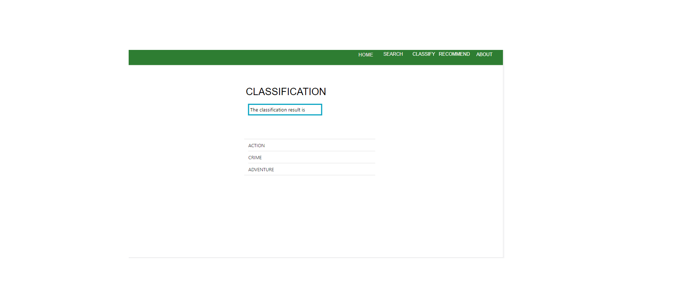

# SearchEngine
This **search engine** is a part of  movie recommendation system.

## Introduction to TF-IDF
TF-IDF stands for “Term Frequency — Inverse Data Frequency”. 
### Term Frequency (tf):###
   TF gives us the frequency of the word in each document in the corpus. It is the ratio of number of times the word appears in a document compared to the total number of words in that document. It increases as the number of occurrences of that word within the document increases. Each document has its own tf.

### Inverse Data Frequency (idf):
IDF used to calculate the weight of rare words across all documents in the corpus. The words that occur rarely in the corpus have a high IDF score. It is given by the equation below.

IF_IDF:
Combining these two we come up with the TF-IDF score (w) for a word in a document in the corpus. It is the product of tf and idf:

### Walkthrough the code
    fdfgdfg
    

REFERENCE:
https://medium.freecodecamp.org/how-to-process-textual-data-using-tf-idf-in-python-cd2bbc0a94a3
