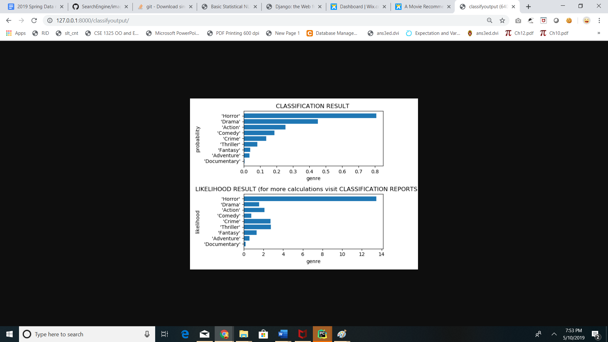

Youtube: https://youtu.be/8NLJOEK07ss

Project link in google cloud - http://35.238.161.0/

# PART I - SearchEngine
This **search engine** is a part of  movie recommendation system. 
## How it works ??
In the search bar of my web page I key in any query/phrase , the 3 most similar "movie overview" which is similar to query is retrieved.
## Dataset used
 Here is the link to the data set which we will be using to build our movie RS.
## Python script file names 
whsh1.py,kag_my1.py,movie_recommendations.py
https://www.kaggle.com/rounakbanik/the-movies-dataset#ratings.csv
## ALGORITHM  USED AND IMPLEMENTATION DETAILS

## Introduction to TF-IDF
TF-IDF stands for “Term Frequency — Inverse Data Frequency”. 
### Term Frequency (tf):
   TF gives us the frequency of the word in each document in the corpus. It is the ratio of number of times the word appears in a document compared to the total number of words in that document. It increases as the number of occurrences of that word within the document increases. Each document has its own tf.
   def computeTF(wordDict, bow):
    tfDict = {}
    bowCount = len(bow)
    for word, count in wordDict.items():
        tfDict[word] = count/float(bowCount)
    return tfDict

### Inverse Data Frequency (idf):
IDF used to calculate the weight of rare words across all documents in the corpus. The words that occur rarely in the corpus have a high IDF score. It is given by the equation below.
   
    def computeIDF(docList):
    import math
    idfDict = {}
    N = len(docList)
    
    idfDict = dict.fromkeys(docList[0].keys(), 0)
    for doc in docList:
        for word, val in doc.items():
            if val > 0:
                idfDict[word] += 1

    for word, val in idfDict.items():
        idfDict[word] = math.log10(N / float(val))

    return idfDict

### TF_IDF:
Combining these two we come up with the TF-IDF score (w) for a word in a document in the corpus. It is the product of tf and idf:
    
    def computeTFIDF(tfBow, idfs):
    tfidf = {}
    for word, val in tfBow.items():
        tfidf[word] = val*idfs[word]
    return tfidf
   

### Cosine Similarity
Compute cosine similarity between the test_tfidf andthe train_tfidf
The cosine similarity between two vectors (or two documents on the Vector Space) is a measure that calculates the cosine of the angle between them. This metric is a measurement of orientation and not magnitude, it can be seen as a comparison between documents on a normalized space because we’re not taking into the consideration only the magnitude of each word count (tf-idf) of each document, but the angle between the documents. 
And that is it, this is the cosine similarity formula. After computing the cosine similarity the top three 3 results are retrieved and displayed in descending order

### Walkthrough the code
The preprocess function converts the text to lowercase and removes all the stop words from the text data.
    
    def preprocess(text):
    stop_words = stopwords.words('english')
    text = str(text)
    text = text.lower()
    #removing noise from data
    text = re.sub('[^a-z\s]', '', text.lower())
    text = [w for w in text.split() if w not in set(stop_words)]
    return ' '.join(text)
Stemming usually refers to a crude heuristic process that chops off the ends of words in the hope of achieving this goal correctly most of the time, and often includes the removal of derivational affixes. It reduce inflectional forms and sometimes derivationally related forms of a word to a common base form. I have used snowball stemmer as the movie data contains movies of different languages.   
    
    def stem(text):
    english_stemmer = SnowballStemmer('english')
    analyzer = CountVectorizer().build_analyzer()
    return (english_stemmer.stem(w) for w in analyzer(text))
    

We calculate the TF-IDF matrix for the train data and test data. And then we compute the cosine similarity between them. We output the top 3 most similar items that matches the query in descending orders

We output the top three results which aremost similar to the query string.
     def movie_search(query):

    df = pandas.read_csv("movies_data1.csv")
    df = df[['original_title', 'overview']]
    df['overview'] = df['overview'].fillna(" ")
    query = preprocess(query)
    count = CountVectorizer(analyzer=stem)
    moviedata_matrix = count.fit_transform(df['overview'])
    tfidf_transformer = TfidfTransformer()
    train_tfidf = tfidf_transformer.fit_transform(moviedata_matrix)
    test_matrix = count.transform([query])
    test_tfidf = tfidf_transformer.transform(test_matrix)
    cosine_similarity_score = cosine_similarity(test_tfidf, train_tfidf)
    result = np.argsort(cosine_similarity_score).tolist()
    df1 = df.iloc[result[0][-3:]]
    return df1.original_title.tolist(),df1.overview.tolist(),result[0][-3:]

### SCREEN SHOTS.
I have designed by web page in django and I have integrated my python script for the search implementation.
    
    

    

As you can see the most similar result is the thrid one, which is most similar to the query

# HOW TO DEPLOY THE CODE:
1.Just copy the github url .In this is case the URL would be 'https://github.com/pavithraradhakrishnan/Recommendation_Engine' And on Pycharm, from the menu bar choose VCS ->Check out from version control -> Git.
2.And when prompted for URL give the URL mentioned earlier and click on clone.
3.After it's done you will get a pop message asking for permission to open the prespective. Click ok.
4. Now we have the copy of the project in pycharm.
5.To run the project from the terminal the command is python manage.py runserver
6.Click on the local host url that appears on the teminal.
7. Now you can use the application in from your local host. 
8. Please check the you tube video for more details about accessing the application

#LINK TO PROJECT ON GOOGLE CLOUD:

http://35.238.161.0/

# PART 2  MOVIE GENRE CLASSIFICATION BASED ON PLOT
INTRODUCTION: 

I have implemented a NLP classifier that predicts the genres according to the plot summaries.

DATA SET:

 I have used Genre and  If you notice there are three genres for each movies. I have taken the first genre for our classification and ignored all other genres. As the first genre best describes our data set.

### DATA CLEANING:

I have removed all stop words from the overview. Also I have applied lemmatization  as it remove inflectional endings only and to return the base or dictionary form of a word .

I have also taken the count of each genres in the data set. And I observed that there is an imbalance in the data set. Here is the count of data points in each genres.

 'Drama'             2360

 'Comedy'            1945

 'Action'            1057

 'Horror'            463

 'Adventure'         411

 'Crime'             359

 'Documentary'       225

 'Thriller'          210

 'Fantasy'           185

 'Romance'           182

 'Animation'         102

 'Science Fiction'   101

 'Mystery'           94

 'Music'             79

 'Western'           71

 'War'               62

 'Family'            54

 'History'           31

 'TV Movie'          5

 'Foreign'           4

As you can see some of the genres have insufficient data points and this would result in inaccurate classification. Hence I have extracted the data points containing the top 9 genres.

## CHALLENGES - CHOOSING THE CLASSIFIER:

I implemented several different classifier before finalizing one.  I implemented  SVM, Multinomial Bayes, Random forest and logistic regression. Out of all these multinomial bayesian classifier gave me the maximum accuracy.Also Bayesian classifier works better with text data.

## UNDERSTANDING MULTINOMIAL NAVIE BAYES:

STEP 1: We first need to calculate the prior probability for all classes(genres). It's nothing but the fraction of document in each class.
STEP 2:Probability of each word per class
For calculating our probability, we will find the average of each word for a given class.
For class j and word i, the average is given by:

However, since some words will have 0 counts, we will perform a Laplace Smoothing with low ɑ:

where V is an array of all the words in the vocabulary
STEP3:
Combining probability distribution of P with fraction of documents belonging to each class.

For class j, word i at a word frequency of f:

In order to avoid underflow, we will use the sum of logs:

One issue is that, if a word appears again, the probability of it appearing again goes up. In order to smooth this, we take the log of the frequency:

Also, in order to take stop words into account, we will add a Inverse Document Frequency (IDF)weight on each word:

## IMPLEMENTATION:

  I have used TF_IDF vectorizer.  I also implemented the multinomial Bayesian classifier. The classifier gave 90% accuracy. However I observed that  the classifier was mis classifying the movies.

This is due to the low precision numbers.

### SOME IMPORTANT TERMS TO KNOW:

 Confusion Matrix: A breakdown of predictions into a table showing correct predictions (the diagonal) and the types of incorrect predictions made (what classes incorrect predictions were assigned)

Precision: A measure of a classifiers exactness

Recall: A measure of a classifiers completeness

F1 Score (or F-score): A weighted average of precision and recall. 

### SOLUTION:

 The misclassification is due to the imbalance in the data points. Hence we used Over sampling to solve this problem.

### SMOTE ALGORITHM: 

A simple way to generate synthetic samples is to randomly sample the attributes from instances in the minority class.

You could sample them empirically within your data set or you could use a method like Naive Bayes that can sample each attribute independently when run in reverse. You will have more and different data, but the non-linear relationships between the attributes may not be preserved.

There are systematic algorithms that you can use to generate synthetic samples. The most popular of such algorithms is called SMOTE or the Synthetic Minority Over-sampling Technique.

As its name suggests, SMOTE is an oversampling method. It works by creating synthetic samples from the minor class instead of creating copies. The algorithm selects two or more similar instances (using a distance measure) and perturbing an instance one attribute at a time by a random amount within the difference to the neighboring instances.

 Oversampling basically means that we'll generate more data for the least common category using the SMOTE algorithm.  

## RESULT: After all the effort. Oversampling+ tifidf +  multinomial bayes gave a more accurate prediction.

## EVALUATION RESULTS:

I have used the KFOLD approach for training the model.  

KFOLD provides train/test indices to split data in train/test sets. Split dataset into k consecutive folds.

Each fold is then used once as a validation while the k - 1 remaining folds form the training set.

# HOW TO DEPLOY THE CODE:
1.Just copy the github url .In this is case the URL would be 'https://github.com/pavithraradhakrishnan/Recommendation_Engine' And on Pycharm, from the menu bar choose VCS ->Check out from version control -> Git.
2.And when prompted for URL give the URL mentioned earlier and click on clone.
3.After it's done you will get a pop message asking for permission to open the prespective. Click ok.
4. Now we have the copy of the project in pycharm.
5.To run the project from the terminal the command is python manage.py runserver
6.Click on the local host url that appears on the teminal.
7. Now you can use the application in from your local host. 
8. Please check the you tube video for more details about accessing the application

#LINK TO PROJECT ON GOOGLE CLOUD:

http://35.238.161.0/
# PART III -RECOMMENDATION SYSTEM:
## CONTENT BASED FILTERING:
Here I have used the content of the movies to find the similar movies for recommendation.
First I have made recommendation based on just the overview of the movie.
Then I also made use of the other fields in the data set like production,director,cast etc to find the similar movies for recommendation.
We will compute pairwise similarity scores for all movies based on their plot descriptions and recommend movies based on that similarity score. The plot description is given in the overview feature of our dataset. Now we have used the TF-IDF and the cosine similarity jus like we did in Part I to find the similarity. And then we tried to recommend with different meta data.

## WALK THROUGH THE CODE
  
 First we remove the stop words and calculate the TF_IDF matrix and calculate the cosine similiarities.We will be using the cosine similarity to calculate a numeric quantity that denotes the similarity between two movies.
 
    tfidf = TfidfVectorizer(stop_words='english')
    df_movies['overview'] = df_movies['overview'].fillna('')
    tfidf_matrix = tfidf.fit_transform(df_movies['overview'])
    cosine_sim = linear_kernel(tfidf_matrix, tfidf_matrix)
    indices = pd.Series(df_movies.index, index=df_movies['title']).drop_duplicates()

We form a meta data with the over view  field and then we use it find the similarity between movies.
We need to do the following
Get the index of the movie given its title.
Get the list of cosine similarity scores for that particular movie with all movies. Convert it into a list of tuples where the first element is its position and the second is the similarity score.
Sort the  list of tuples based on the similarity scores; that is, the second element.
Get the top 10 elements of this list. Ignore the first element as it refers to self (the movie most similar to a particular movie is the movie itself).
Return the titles corresponding to the indices of the top elements.
       
    def recommendations(title, cosine_sim=cosine_sim):
      idx = indices[title]
      sim_scores = list(enumerate(cosine_sim[idx]))
      sim_scores = sorted(sim_scores, key=lambda x: x[1], reverse=True)
      sim_scores = sim_scores[1:11]
      movie_indices = [i[0] for i in sim_scores]
      return df_movies['title'].iloc[movie_indices

We will also find recommend movies with different meta data other than just overview.The function extract_director,get_list,get_production_company is used to extract the director,cast and production company respectively.This will form our new meta data.
     
     
     def extract_director(x):
    for i in x:
        if i['job'] == 'Director':
            return i['name']
    return np.nan

    def get_list(x):
    if isinstance(x, list):
        names = [i['name'] for i in x]
        if len(names) > 3:
            names = names[:3]
        return names
    return []

    def get_production_company(x):
    if isinstance(x, list):
        names = [i['name'] for i in x]
        if len(names) > 1:
            names = names[:1]
        return names
        
    df_movies['director'] = df_movies['crew'].apply(extract_director)
    df_movies['production_companies'] = df_movies['production_companies'].apply(get_production_company)
    features = ['cast', 'keywords', 'genres']
    for feature in features:
       df_movies[feature] = df_movies[feature].apply(get_list)

    df_movies[['title', 'cast', 'director', 'keywords', 'genres','production_companies']].head(3)
    
    

Now here we ll use a Count vectorizer instead of TF-IDF because we don't have to down weight if the actor acted in many movies.We will repeat the same process as mentioned  above and we will return the titles corresponding to the indices of top element.

    
## SCREEN SHOT

# HOW TO DEPLOY THE CODE:
1.Just copy the github url .In this is case the URL would be 'https://github.com/pavithraradhakrishnan/Recommendation_Engine' And on Pycharm, from the menu bar choose VCS ->Check out from version control -> Git.
2.And when prompted for URL give the URL mentioned earlier and click on clone.
3.After it's done you will get a pop message asking for permission to open the prespective. Click ok.
4. Now we have the copy of the project in pycharm.
5.To run the project from the terminal the command is python manage.py runserver
6.Click on the local host url that appears on the teminal.
7. Now you can use the application in from your local host. 
8. Please check the you tube video for more details about accessing the application

#LINK TO PROJECT ON GOOGLE CLOUD:

http://35.238.161.0/
 
 
    

REFERENCE:
https://medium.freecodecamp.org/how-to-process-textual-data-using-tf-idf-in-python-cd2bbc0a94a3
https://nlp.stanford.edu/IR-book/html/htmledition/stemming-and-lemmatization-1.html
https://github.com/mayank408/TFIDF
https://www.kaggle.com/guilherme93/nlp-movie-genre-prediction-from-plot/notebook
https://www.kaggle.com/ibtesama/getting-started-with-a-movie-recommendation-system/data#Content-Based-Filtering
https://github.com/Heetmadhu/Movie-Recommendation
https://towardsdatascience.com/multinomial-naive-bayes-classifier-for-text-analysis-python-8dd6825ece67
